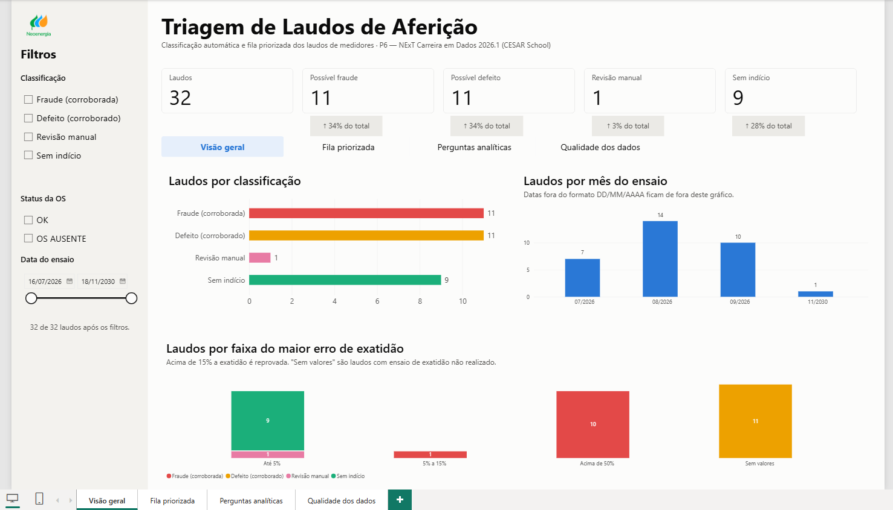
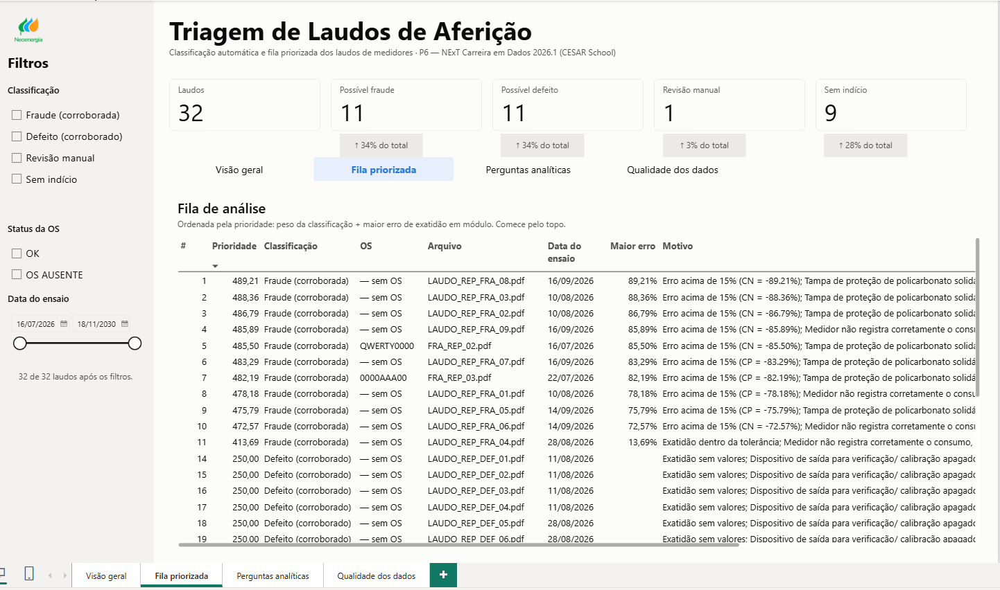
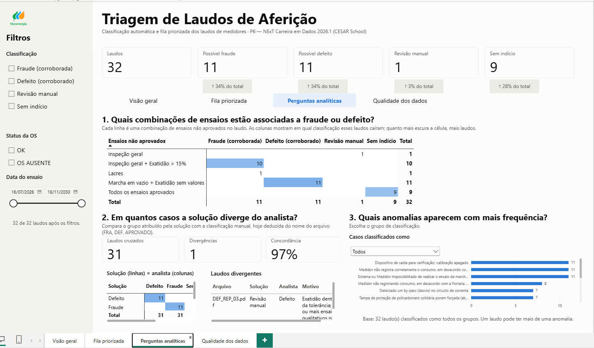
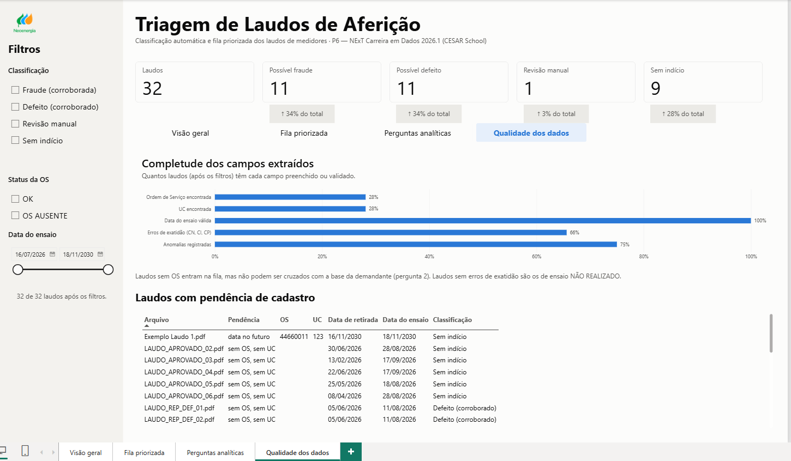

# P6 — Triagem de Laudos

Pipeline em Python que lê laudos de aferição de medidores de energia elétrica em PDF, extrai os resultados dos ensaios, classifica cada laudo em **possível fraude/manipulação**, **possível defeito**, **sem indício identificado** ou **revisão manual**, calcula uma prioridade e grava tudo em um banco PostgreSQL. A partir do banco, é gerada a fila priorizada para análise.

Projeto do módulo M6 — Experiência Prática do programa **NExT Carreira em Dados 2026.1 (CESAR School)**. A apresentação final, do Pitch Day de 08/10/2026, está em [`pitch/slides.pdf`](pitch/slides.pdf) e resumida na seção [Pitch](#pitch).

---

## Contexto

A área demandante é a Gestão de Perdas da Neoenergia Pernambuco, e quem decide caso a caso é o Analista de Perdas. Ela recebe laudos de laboratório sobre medidores retirados de campo, em média 810 por mês. Hoje a triagem é manual: alguém abre cada PDF, lê os ensaios e decide se o caso indica fraude, defeito ou nada. O objetivo do projeto é transformar essa leitura em uma **regra escrita e reproduzível**, aplicada automaticamente, para que o analista comece pelos casos de maior impacto. Com cerca de 20 minutos de análise por laudo, a leitura manual consome aproximadamente 270 horas por mês (810 × 20 min ÷ 60; fonte: `docs/01_problema_e_dados.md`).

## Problema e dados

A triagem dos laudos de aferição de medidores é realizada manualmente, envolvendo a leitura dos resultados dos ensaios, identificação de anomalias e classificação dos casos. O projeto busca automatizar parte dessa análise a partir dos laudos em PDF, apoiando a classificação e a priorização dos casos para análise.

Os dados de entrada são laudos de aferição em PDF, contendo informações de identificação, resultados dos ensaios, erros de energia ativa, anomalias e conclusão do laboratório.

A documentação detalhada sobre o problema, perguntas analíticas, fonte dos dados, regras de negócio, validações, limitações e dicionário de dados está em `docs/01_problema_e_dados.md`.

## Entregas

| Entrega | Onde está |
|---|---|
| Regra de classificação escrita | Seção [Regra de classificação](#regra-de-classificação) e função `classificar_laudo()` em `analise.py` |
| Cálculo de prioridade | Seção [Prioridade](#prioridade) e função `calcular_prioridade()` em `analise.py` |
| Pipeline com validação na entrada | `extracao.py` |
| Problema, perguntas analíticas e documentação dos dados | `docs/01_problema_e_dados.md` |
| Dashboard em Power BI | Pasta `dashboard/` e seção [Dashboard](#dashboard-power-bi) |
| Apresentação final (pitch) | Pasta `pitch/` e seção [Pitch](#pitch) |

---

## Como funciona

```
dados/brutos/*.pdf
      │
      ▼
1. Cálculo do hash do arquivo (SHA-256) ── já existe no banco? ──► ignorado
      │
      ▼
2. Leitura do PDF (pypdf)
      │
      ▼
3. Extração dos campos (UC, OS, datas, ensaios, erros de exatidão, anomalias, conclusão)
      │
      ▼
4. Validação (PDF sem texto, data do ensaio, OS válida, OS repetida em outro arquivo)
      │
      ▼
5. Classificação e prioridade (analise.py)
      │
      ▼
6. Gravação no PostgreSQL (tabela laudos)  ──►  7. Exportação da tabela para dados/amostra/laudos.csv
```

### Identificação dos laudos e controle de duplicidade

Cada PDF é identificado pelo **hash SHA-256 do seu conteúdo** (`hash_arquivo`). O mesmo arquivo gera sempre o mesmo hash, mesmo que seja renomeado. A cada execução, o script lê todos os PDFs da pasta `dados/brutos` e ignora os que já estão no banco.

A **Ordem de Serviço (OS)** continua sendo o identificador de negócio do laudo, mas não é mais obrigatória:

- Quando a OS é encontrada, ela é gravada e `status_os = 'OK'`.
- Quando o campo está vazio no PDF, o laudo **é processado normalmente** (classificação e prioridade), com `ordem_servico = NULL` e `status_os = 'OS AUSENTE'`.
- O valor lido só é aceito como OS se tiver apenas letras e números, pelo menos um dígito e no mínimo 6 caracteres. Isso evita capturar rótulos vizinhos do PDF (como `UF` ou `ORDEM`) quando o campo está em branco.
- Se a mesma OS aparecer em **outro arquivo** (hash diferente), o laudo não é gravado e aparece na lista de erros como **possível reemissão**, para análise manual.

---

## Regra de classificação

A regra está em `classificar_laudo()` (`analise.py`) e é aplicada a cada laudo nesta ordem.

**Passo 1: ensaios qualitativos.** Verifica se os 4 ensaios abaixo estão **APROVADOS**:

- Integridade dos Lacres
- Inspeção Geral do Medidor
- Correspondência com o Modelo Aprovado
- Ensaio de Marcha em Vazio

**Passo 2: exatidão.** Verifica os erros de energia ativa (carga nominal, indutiva e pequena). Se qualquer erro, em módulo, for **superior a 15%**, a exatidão é considerada reprovada. Se o laudo não traz valores de erro (por exemplo, ensaio NÃO REALIZADO), a exatidão fica "sem valores".

Há **evidência técnica** quando algum ensaio qualitativo não foi aprovado **ou** a exatidão foi reprovada.

**Passo 3: anomalias descritas no laudo.** O texto da seção "Anomalia(s) Encontrada(s)" é comparado com listas de padrões:

| Grupo | Padrões procurados (sem acento, minúsculas) |
|---|---|
| Fraude/manipulação | tampa forçada, tampa aberta, by-pass, "não registra corretamente o consumo" |
| Defeito | display apagado, dispositivo de saída apagado |

Os padrões de fraude são testados antes dos de defeito.

**Resultado:**

| Situação | Classificação |
|---|---|
| Anomalia de fraude + evidência técnica | Possível fraude/manipulação (corroborada tecnicamente) |
| Anomalia de fraude sem evidência técnica | Possível fraude/manipulação (indício apenas textual) |
| Anomalia de defeito + evidência técnica | Possível defeito (corroborado tecnicamente) |
| Anomalia de defeito sem evidência técnica | Possível defeito (indício apenas textual) |
| Nenhuma anomalia reconhecida, 4 ensaios aprovados e exatidão aprovada | Sem indício identificado |
| Qualquer outro caso | Revisão manual |

A coluna `motivo_classificacao` registra o caminho percorrido (resultado da exatidão, maior erro e anomalia encontrada), para que cada decisão possa ser auditada.

## Prioridade

A prioridade é calculada em `calcular_prioridade()` (`analise.py`): um peso pela classificação somado ao maior erro de exatidão, em módulo, entre CN, CI e CP. Quanto maior o valor, mais cedo o laudo deve ser analisado.

| Classificação | Peso |
|---|---|
| Possível fraude/manipulação (corroborada tecnicamente) | 400 |
| Possível fraude/manipulação (indício apenas textual) | 300 |
| Possível defeito (corroborado tecnicamente) | 250 |
| Possível defeito (indício apenas textual) | 200 |
| Revisão manual | 100 |
| Sem indício identificado | 0 |

Exemplo: um laudo de fraude corroborada com maior erro de -89,21% recebe prioridade 400 + 89,21 = **489,21**.

---

### Configurar o banco

1. Crie o database **uma única vez**. O script cria a tabela, mas não cria o database. No DBeaver ou no psql:

   ```sql
   CREATE DATABASE triagem_laudos;
   ```

2. No início do `extracao.py`, ajuste as credenciais para as do **seu** PostgreSQL:

   ```python
   HOST = "localhost"
   PORTA = 5432
   BANCO = "triagem_laudos"
   USUARIO = "postgres"
   SENHA = "sua_senha"
   ```

   Não faça commit do arquivo com a sua senha real.

### Atualizando de uma versão anterior

A partir da versão com identificação por hash, a tabela `laudos` ganhou as colunas `hash_arquivo` e `status_os`, e `ordem_servico` deixou de ser obrigatória. O comando `CREATE TABLE IF NOT EXISTS` **não altera uma tabela já existente**. Quem já tinha a tabela criada deve apagá-la antes de rodar a nova versão:

```sql
DROP TABLE laudos;
```

Na execução seguinte, a tabela é recriada e todos os PDFs da pasta `dados/brutos` são reprocessados.


## Execução

Coloque os PDFs em `dados/brutos/` e rode:

```powershell
python extracao.py
```

Ao final, o terminal mostra o resumo:

```
Resumo da ingestão:
Novos registros: 8
Já existentes: 0
Erros: 0
```

PDFs que não puderam ser lidos (por exemplo, escaneados, sem texto) aparecem na lista de erros e não interrompem o processamento dos demais.

## Visualizar no DBeaver

1. **Nova conexão → PostgreSQL**, com host `localhost`, porta `5432`, e o mesmo usuário e senha configurados no `extracao.py`.
2. Navegue até `triagem_laudos → Esquemas → public → Tabelas → laudos`. Se a tabela não aparecer, aperte **F5**.
3. Exemplos de consulta:

   ```sql
   -- Fila priorizada
   SELECT id, ordem_servico, status_os, arquivo,
          classificacao, prioridade, motivo_classificacao
   FROM laudos
   ORDER BY prioridade DESC;

   -- Laudos sem Ordem de Serviço
   SELECT id, arquivo, classificacao, prioridade
   FROM laudos
   WHERE status_os = 'OS AUSENTE';
   ```

---
## Dashboard (Power BI)

O dashboard apresenta os laudos já classificados pelo pipeline em quatro páginas: visão geral, fila priorizada, perguntas analíticas e qualidade dos dados. Todas têm os mesmos filtros laterais (**Classificação**, **Status da OS** e **Data do ensaio**) e os mesmos cartões no topo, com o total de laudos e a quantidade e o percentual de cada classificação.

### Fonte dos dados

Os dados chegam ao Power BI pelo **PostgreSQL**: o relatório lê a tabela `laudos` do banco `triagem_laudos`, populada pelo `extracao.py`. O dashboard não lê os PDFs diretamente.

Para atualizar depois de processar novos PDFs:

1. Rode `python extracao.py` para gravar os novos laudos no banco.
2. Abra o `.pbix` no Power BI Desktop, com o PostgreSQL em execução.
3. Clique em **Página Inicial → Atualizar**. Se o servidor ou o banco forem diferentes dos configurados, ajuste em **Transformar dados → Configurações da fonte de dados**.

Sem acesso ao banco, o `.pbix` abre normalmente e mostra os dados da última atualização, mas não atualiza.

### Arquivos

| Arquivo | Descrição |
|---|---|
| [`dashboard/dashboard_neoenergia.pbix`](dashboard/dashboard_neoenergia.pbix) | Relatório do Power BI Desktop (abrir para explorar e filtrar) |
| [`dashboard/dashboard_neoenergia.pdf`](dashboard/dashboard_neoenergia.pdf) | Exportação do relatório completo, para consulta sem o Power BI |
| [`dashboard/prints/`](dashboard/prints) | Imagens de cada página do dashboard (exibidas abaixo) |

Para abrir o `.pbix`, é necessário o [Power BI Desktop](https://www.microsoft.com/pt-br/power-platform/products/power-bi/desktop) (Windows, gratuito).

### Páginas

Os números abaixo se referem à amostra de **32 laudos** exibida nos prints: 11 possível fraude (34%), 11 possível defeito (34%), 1 revisão manual (3%) e 9 sem indício (28%).

#### 1. Visão geral

Três gráficos:

- **Laudos por classificação.**
- **Laudos por mês do ensaio.** Datas fora do formato DD/MM/AAAA ficam de fora deste gráfico.
- **Laudos por faixa do maior erro de exatidão** (até 5%, de 5% a 15%, acima de 50% e "sem valores"). Acima de 15% a exatidão é reprovada; "sem valores" são os laudos com ensaio de exatidão não realizado.



#### 2. Fila priorizada

Tabela **Fila de análise**, ordenada pela prioridade (peso da classificação + maior erro de exatidão em módulo, conforme `calcular_prioridade()`). O analista deve começar pelo topo. Colunas: posição, prioridade, classificação, OS, arquivo, data do ensaio, maior erro e motivo da classificação. Laudos sem OS aparecem como "— sem OS".



#### 3. Perguntas analíticas

Responde às perguntas analíticas definidas em `docs/01_problema_e_dados.md`:

1. **Quais combinações de ensaios estão associadas a fraude ou defeito?** Matriz com as combinações de ensaios não aprovados nas linhas e as classificações nas colunas. Quanto mais escura a célula, mais laudos. Na amostra, "inspeção geral + exatidão > 15%" concentra 10 casos de fraude e "marcha em vazio + exatidão sem valores" concentra os 11 casos de defeito.
2. **Em quantos casos a solução diverge do analista?** Compara a classificação da solução com a do analista, **deduzida do prefixo do nome do arquivo** (FRA, DEF, APROVADO), e não com a classificação manual real da demandante. Na amostra, são 31 laudos cruzados, 1 divergência e 97% de concordância. O laudo divergente é `DEF_REP_03.pdf`, classificado pela solução como revisão manual e pelo analista como defeito.
3. **Quais anomalias aparecem com mais frequência?** Gráfico de barras com filtro por grupo de classificação. Um laudo pode ter mais de uma anomalia.



#### 4. Qualidade dos dados

- **Completude dos campos extraídos:** percentual de laudos com cada campo preenchido ou validado. Na amostra: Ordem de Serviço 28%, UC 28%, data do ensaio válida 100%, erros de exatidão 66% e anomalias registradas 75%. Laudos sem erros de exatidão são os de ensaio NÃO REALIZADO.
- **Laudos com pendência de cadastro:** lista dos laudos com problemas, como OS e UC ausentes ou data no futuro.

Laudos sem OS entram na fila, mas não podem ser cruzados com a base da demandante (pergunta analítica 2).



### Estrutura da pasta

```
dashboard/
├── dashboard_neoenergia.pbix
├── dashboard_neoenergia.pdf
└── prints/
    ├── 01_visao_geral.png
    ├── 02_fila_priorizada.png
    ├── 03_perguntas_analiticas.png
    └── 04_qualidade_dados.png
```
## Pitch

Apresentação final do projeto no Pitch Day do NExT Carreira em Dados 2026.1, em 08/10/2026, sob o título **"Triagem de Laudos: do PDF de aferição à fila priorizada para o Analista de Perdas"**.

### Arquivo

| Arquivo | Descrição |
|---|---|
| [`pitch/slides.pdf`](pitch/slides.pdf) | Slides da apresentação (PDF) |

### Roteiro

| Bloco | O que cobre |
|---|---|
| O problema | 810 laudos por mês × 20 min de análise ≈ 270 horas de leitura manual por mês |
| Quem decide e o que está em jogo | O Analista de Perdas decide caso a caso. Volume alto, classificação inconsistente (rotatividade e subjetividade) e risco de cobrança equivocada |
| A solução | Pipeline em cinco etapas: laudos em PDF, extração e validação, regra de classificação, banco PostgreSQL e dashboard Power BI. A decisão final continua com o analista; a solução diz por onde começar |
| A regra e a prioridade | Três verificações (ensaios qualitativos, exatidão e anomalias no texto), com motivo registrado. Prioridade = peso da classificação + maior erro de exatidão em módulo |
| Demonstração | As quatro páginas do dashboard: visão geral, fila priorizada, perguntas analíticas e qualidade dos dados |
| Resultados | Quatro números da amostra, cada um com a ação que sugere (abaixo) |
| Próximos passos | Limitações conhecidas e o caminho para resolver cada uma (seção [Limitações conhecidas e próximos passos](#limitações-conhecidas-e-próximos-passos)) |

### Resultados apresentados

Todos os números se referem à amostra de **32 laudos**:

- **22 de 32 laudos com indício de fraude ou defeito.** O analista começa por eles e deixa os 9 sem indício para depois.
- **10 de 11 fraudes com inspeção geral reprovada e exatidão acima de 15%.** Ação: validar com a demandante esse par de ensaios como sinal forte de fraude.
- **11 de 11 defeitos com marcha em vazio e exatidão sem valores.** Ação: usar o ensaio não realizado para separar defeito de fraude.
- **97% de concordância em 31 laudos, com 1 divergência.** Ressalva: a referência do analista é deduzida do nome do arquivo, não da classificação manual real da demandante.

Na página de qualidade dos dados, só 28% dos laudos trazem OS e UC preenchidas, o que limita o cruzamento com a base da demandante. O hash do arquivo permite identificar o laudo mesmo sem OS.

---

## Dicionário de dados: tabela `laudos`

| Coluna | Tipo | Descrição |
|---|---|---|
| `id` | SERIAL | Chave primária. Identificador usado para referenciar o laudo nas análises |
| `hash_arquivo` | TEXT (único, obrigatório) | Hash SHA-256 do conteúdo do PDF; usado para evitar duplicidade |
| `ordem_servico` | TEXT (único, opcional) | Ordem de serviço do laudo; `NULL` quando o campo está vazio no PDF |
| `status_os` | TEXT | `OK` ou `OS AUSENTE` |
| `arquivo` | TEXT | Nome do PDF de origem |
| `uc` | TEXT | Unidade consumidora |
| `dt_retirada` | TEXT | Data de retirada do medidor |
| `data_ensaio` | TEXT | Data do ensaio em laboratório |
| `validacao_data_ensaio` | TEXT | `OK`, `NÃO ENCONTRADA`, `FORMATO INVÁLIDO` ou `DATA INVÁLIDA` |
| `integridade_lacres` | TEXT | APROVADO / REPROVADO |
| `inspecao_geral_medidor` | TEXT | APROVADO / REPROVADO |
| `correspondencia_mod_aprovado` | TEXT | APROVADO / REPROVADO |
| `ensaio_marcha_vazio` | TEXT | APROVADO / REPROVADO / NÃO REALIZADO |
| `erro_ativa_cn` | REAL | Erro (%) de energia ativa em carga nominal |
| `erro_ativa_ci` | REAL | Erro (%) de energia ativa em carga indutiva |
| `erro_ativa_cp` | REAL | Erro (%) de energia ativa em carga pequena |
| `resultado_exatidao_ativa` | TEXT | Resultado de exatidão informado no laudo |
| `analise_exatidao` | TEXT | Resultado recalculado pelo limite do projeto (erro superior a 15%) |
| `anomalias` | TEXT | Anomalias descritas, separadas por ` \| ` |
| `conclusao` | TEXT | Texto de conclusão/observações do laudo |
| `classificacao` | TEXT | Resultado da regra de classificação |
| `prioridade` | REAL | Peso da classificação + maior erro de exatidão em módulo |
| `motivo_classificacao` | TEXT | Justificativa da classificação |
| `data_ingestao` | TEXT | Data e hora em que o registro entrou no banco |

---

## Limitações conhecidas e próximos passos

- **Registros existentes não são atualizados:** se a regra mudar, os laudos já gravados mantêm a classificação antiga. Para reclassificar, limpe a tabela (`TRUNCATE laudos;`) e rode o script novamente.
- **Laudos sem OS não podem ser cruzados com a base da demandante:** eles entram na triagem e na fila, mas ficam fora da comparação com a classificação manual do analista (pergunta analítica 2), que depende da OS como chave. Nos exemplos analisados, a UC e o Nº do Medidor também vêm vazios, então não servem como chave alternativa. No dashboard, enquanto a base da demandante não está disponível, a pergunta 2 usa como referência a classificação do analista deduzida do prefixo do nome do arquivo (FRA, DEF, APROVADO)
- **Reemissão de laudos:** um laudo reemitido (PDF diferente com a mesma OS) não é gravado; fica na lista de erros para análise. Falta definir com a área demandante se a reemissão deve substituir o registro anterior. Um laudo que entrou sem OS e depois é reemitido com a OS preenchida entra como um segundo registro.
- **Datas armazenadas como texto:** a conversão para `DATE`/`TIMESTAMP` facilitaria filtros por período.
- **PDFs escaneados:** não são suportados (não há OCR).
- **Prioridade técnica, sem impacto financeiro:** o peso considera a classificação e o maior erro de exatidão, mas não o valor envolvido. É preciso definir com a demandante os critérios de valor e incorporá-los ao peso. Com a amostra real de 12 meses, a regra pode ser validada e a fila passa a refletir o impacto financeiro.
- **Dashboard não atualiza sozinho:** o `.pbix` mostra os dados da última atualização. Depois de processar novos PDFs, é preciso atualizar a fonte no Power BI Desktop e exportar de novo o PDF e os prints.

---

## Equipe


| Nome | GitHub |
|---|---|
| Paulo Giovane Ximenes  | [@pgiovaneximenes](https://github.com/pgiovaneximenes) |
| Marcelo Guimaraes | [@marcel0g](https://github.com/marcel0g) |
| Rodrigo Amorim  | [@rodrigoamorim182](https://github.com/rodrigoamorim182) |
| Maria Alice Gadelha | [@mariaalicegadelha](https://github.com/mariaalicegadelha) |
| Paulo Neves | [@pneves953](https://github.com/pneves953) |
| Luiza Delgado | [@delgadoluiza](https://github.com/delgadoluiza) |
| Amanda Conceição | [@amanda87eng-ship-it](https://github.com/amanda87eng-ship-it) |
| Maria Clara Carvalho | [@mclarabritocarvalho-ship-it](https://github.com/mclarabritocarvalho-ship-it) |
| Ana Carolina Martir| [@acarolmartir-dotcom](https://github.com/acarolmartir-dotcom) |
| Victor Silva | [@Victor-CSilva](https://github.com/Victor-CSilva) |

Mentor: Ricardo Teixeira
